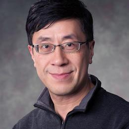

::: {.column-screen}
::: {.hero-banner}
::: {.hero-text}
# TAIH Symposium 2026
### First Annual TAIH Symposium at the University of Calgary

::: {#countdown}
:::

 

[Free Registration](https://www.eventbrite.ca/e/2026-transdisciplinary-ai-hub-taih-annual-symposium-tickets-1986037603936){.btn .btn-success .btn-lg target="_blank" role="button"}
:::
:::
:::

::: {.column-body}

 

Welcome to the **TAIH Symposium 2026**, hosted by the **Transdisciplinary Artificial Intelligence Hub (TAIH)**. This inaugural event brings together researchers, practitioners, and industry leaders to discuss the latest advancements, transparent methodologies, and real-world applications in AI and connected research fields.

For more information about TAIH, visit [our website](https://wpsites.ucalgary.ca/transdisciplinary-ai-hub/){target="_blank"}.

**Date:** May 26, 2026 \
**Location:** University of Calgary, Alberta, Canada

---

## About the Symposium
Machine learning and artificial intelligence are increasingly deployed in high-stakes domains. However, ensuring trustworthiness, transparency, and accountability remains a critical challenge. This symposium aims to advance research by exploring robust methodologies, interpreting model-driven decisions, and ensuring reliability in real-world use cases.

## Confirmed Speakers

The symposium includes a number of talks by invited speakers. More details will follow soon.

::: {.grid}

::: {.g-col-12 .g-col-md-4 .text-center}
{.speaker-img width=150}

**Jessalyn Holodinsky, PhD** \
Assistant Professor  
University of Calgary

View Bio

Dr. Jessalyn Holodinsky is an Assistant Professor of Data Science in the Department of Emergency Medicine at the University of Calgary, where she leads the Calgary Emergency Medicine Data Lab and is the Director of AI and Data Education through the Office of Faculty Development at the Cumming School of Medicine. Her work explores how AI can be used to predict patient flow, anticipate demand, and optimize how emergency departments operate. She is particularly interested in how AI systems behave in the real world: not just whether they work in theory, but whether they work in the right settings, for the right populations, and in ways that meaningfully improve how care is delivered. At the core of her work is a simple belief: that better data, used well, saves lives.

:::

::: {.g-col-12 .g-col-md-4 .text-center}
{.speaker-img width=150}

**Henry Leung, PhD** \
Professor  
University of Calgary

View Bio

Dr. Henry Leung is a Professor in the Department of Electrical and Software Engineering. His research focuses on machine learning, data analytics, information fusion, robotics, sensor networks and IoT, and signal and image processing.

:::

::: {.g-col-12 .g-col-md-4 .text-center}
{.speaker-img width=150}

*coming soon*
:::

:::

## Organizers

* **Samira Ebrahimi Kahou**, Associate Professor
* **Steve Drew**, Assistant Professor
* **Mostafa Farrokhabadi**, Assistant Professor
* **Vincent Michalski**, PhD
* **Ankur Garg**, PhD student
* **Nils Kiele**, PhD student
* **Niki Mehri**, MEng student

**Questions?** Contact us at [transdisciplinaryaihub@gmail.com](mailto:transdisciplinaryaihub@gmail.com).

:::

